# Wind Turbine SCADA Data Analysis & Power BI Dashboard

## Overview
This project performs end-to-end analysis of SCADA (Supervisory Control and Data Acquisition) data from a wind turbine recorded across the year 2018. The dataset was sourced from Kaggle. Data cleaning, feature engineering, and exploratory data analysis were carried out in Python using pandas, matplotlib, and seaborn. The processed data was then imported into Power BI to build an interactive 3-page dashboard covering power generation trends, wind behavior, and turbine performance analysis.

---

## Dataset
- **Source:** [Kaggle – Wind Turbine SCADA Dataset](https://www.kaggle.com/datasets/berkerisen/wind-turbine-scada-dataset)
- **Period:** January 2018 – December 2018
- **Key Columns:** Date/Time, Wind Speed (m/s), Wind Direction (°), LV ActivePower (kW), Theoretical_Power_Curve (KWh)
- **Engineered Columns:** Month, Hour, Day, Efficiency, Power Loss

---

## Tools Used
| Tool | Purpose |
|------|---------|
| Python (pandas) | Data loading, cleaning, type conversion, feature engineering |
| Python (matplotlib, seaborn) | Exploratory data analysis and chart generation |
| Power BI (Power Query / M) | Data transformation and import |
| Power BI (DAX) | Measures for KPIs, efficiency, power loss, run rate |
| Power BI (Dashboard) | Interactive 3-page visual report |

---

## Workflow
1. Loaded raw SCADA CSV and inspected data types, missing values, and duplicates
2. Converted `Date/Time` column to datetime format and extracted `Month`, `Hour`, and `Day`
3. Checked for anomalies — zero negative wind speed values found; negative active power records identified and retained as valid operational observations (turbine self-consumption during standby)
4. Engineered two new features: `Efficiency` (Actual / Theoretical Power) and `Power Loss` (Theoretical − Actual Power)
5. Performed full exploratory data analysis with 9 visualizations covering distributions, scatter plots, time patterns, and correlations
6. Exported cleaned and enriched dataset as `Processed_Data.csv`
7. Imported processed data into Power BI and built DAX measures for all KPIs
8. Designed an interactive 3-page dashboard with slicers for Date, Wind Speed, Month, and Hour

---

## Key Insights

### Power Generation
- **March and August are peak production months**, generating approximately 8.7M kW and 8.8M kW respectively, while July recorded the lowest generation at just 2.1M kW — indicating strong seasonal variation likely driven by wind availability
- **Active power distribution is bimodal** — a large concentration of readings sits near 0 kW (low-wind/standby periods) and another spike clusters at the rated capacity of ~3,500 kW, with relatively few observations in between, suggesting the turbine operates efficiently when wind is sufficient

### Wind Speed & Power Relationship
- **Wind speed is the strongest driver of power output**, with a correlation of 0.91 between wind speed and active power
- **The power curve follows a clear S-shape** — output remains near zero below ~4 m/s (cut-in speed), ramps steeply between 4–12 m/s, and plateaus at the rated capacity of ~3,600 kW beyond 12 m/s, closely matching the theoretical power curve
- **Wind direction has negligible influence** on power output (correlation: −0.06), confirming the turbine's yaw control system adjusts orientation effectively regardless of wind direction

### Performance & Power Loss
- **Total power loss across 2018 is 9M kW**, representing the gap between theoretical and actual generation — visible as a consistent spread below the diagonal in the Actual vs. Theoretical scatter plot
- **Power loss peaks at mid-range wind speeds (8–15 m/s)** where the turbine is expected to ramp up, suggesting underperformance during critical generation windows — likely due to curtailment, faults, or suboptimal pitch control
- **February recorded the highest monthly power loss (~2M kW)**, followed by August (~1M kW) and December (~1M kW)
- **Negative active power events were identified** at very low wind speeds (below 3.5 m/s), representing turbine self-consumption during standby and startup sequences — these are valid operational observations and were retained in the dataset

### Hourly Patterns
- **Power generation dips noticeably during midday hours (8 AM – 12 PM)**, averaging around 1,050–1,100 kW, while early morning (12 AM – 4 AM) and evening hours (4 PM – 11 PM) show higher averages of ~1,380–1,470 kW — suggesting wind speeds are consistently lower during midday in this location

### Correlation Summary
| Variable Pair | Correlation |
|---|---|
| Wind Speed vs Active Power | 0.91 |
| Theoretical Power vs Active Power | 0.95 |
| Wind Direction vs Active Power | −0.06 |

---

## Python EDA Charts

| Chart | Description |
|-------|-------------|
| 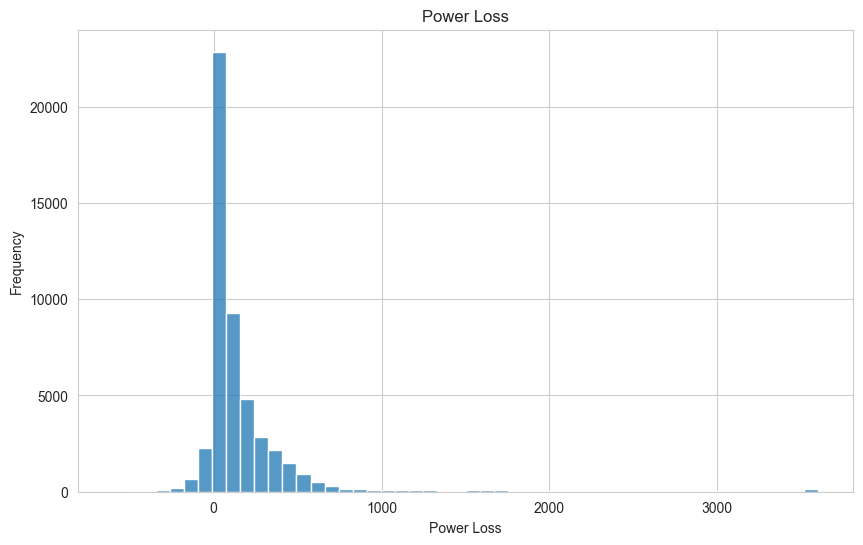 | Majority of power loss values are near zero; right-skewed with a small number of extreme loss events up to 3,600 kW |
| 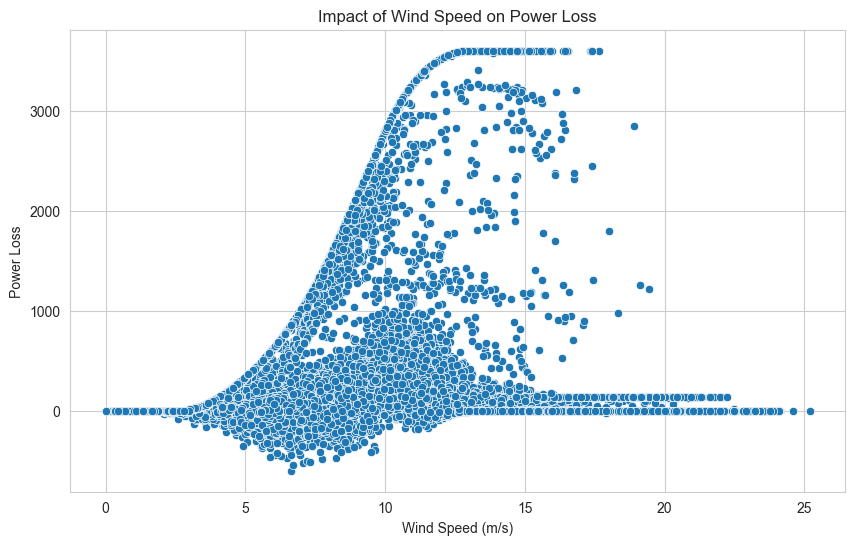 | Power loss increases with wind speed up to ~15 m/s, then stabilizes; negative values visible at low wind speeds (self-consumption) |
| 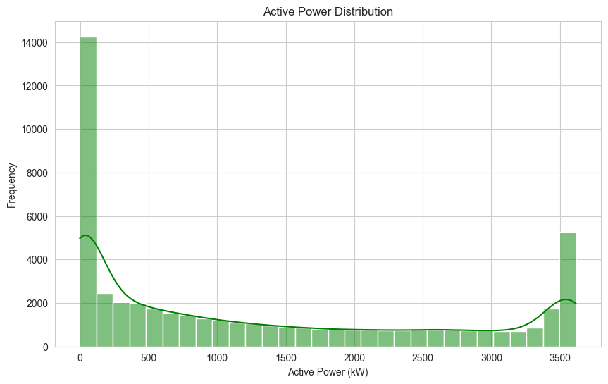 | Bimodal distribution — high frequency near 0 kW and at rated capacity ~3,500 kW |
| 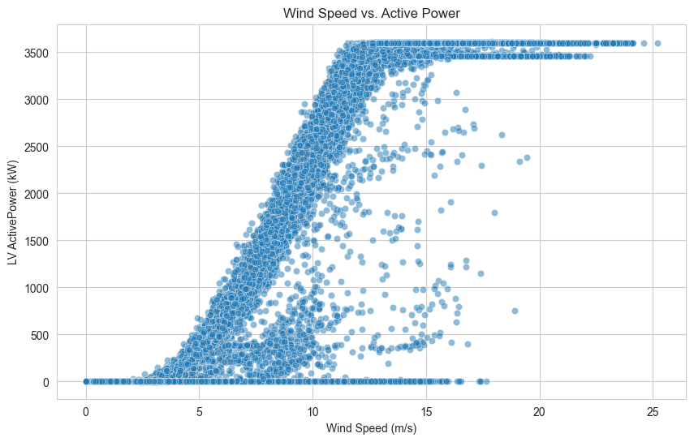 | Classic S-curve power characteristic; clear cut-in (~4 m/s) and rated speed (~12 m/s) visible |
| 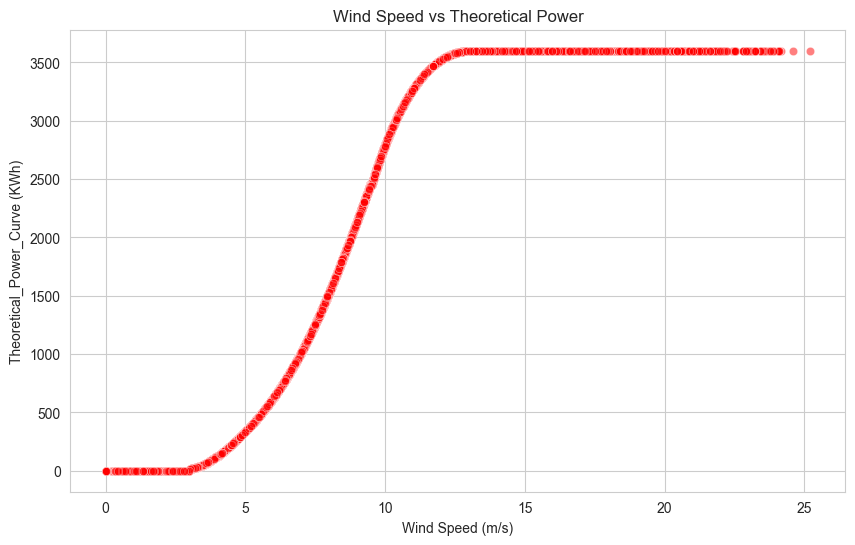 | Smooth, clean S-curve confirming the theoretical power curve plateaus at 3,600 kW |
| 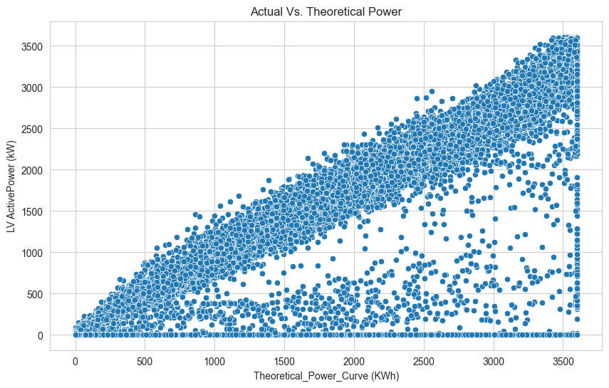 | Strong linear relationship (r=0.95); actual power consistently below theoretical across all output levels |
| 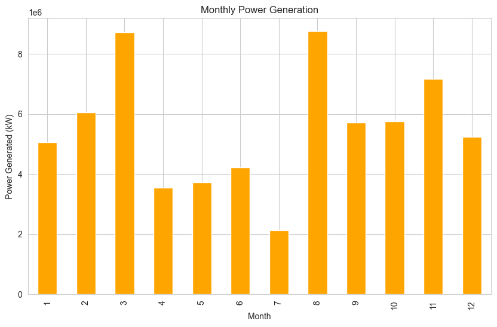 | March and August peak; July lowest — clear seasonal production pattern |
| 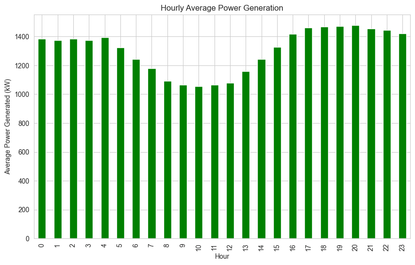 | Midday dip in generation (8 AM–12 PM); stronger output in early morning and evening hours |
| 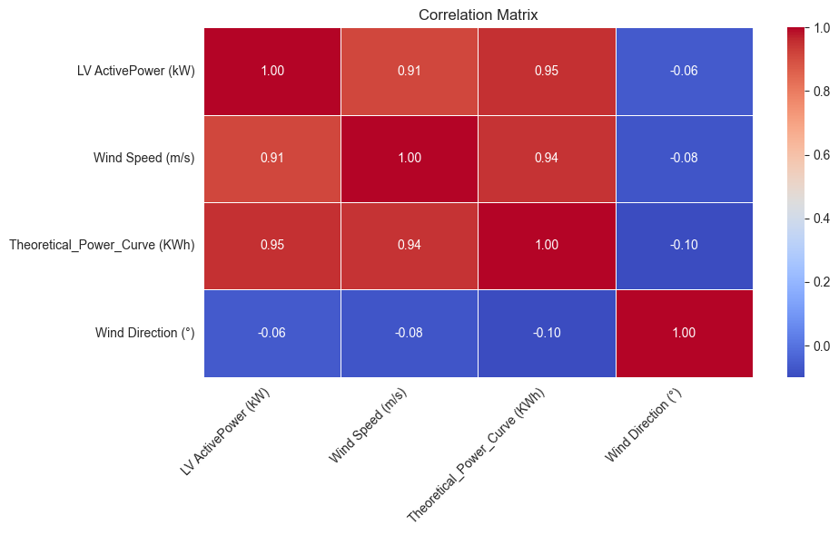 | Wind speed and theoretical curve strongly correlated with output; wind direction has near-zero impact |

---

## Power BI Dashboard

### Page 1: Overview Dashboard
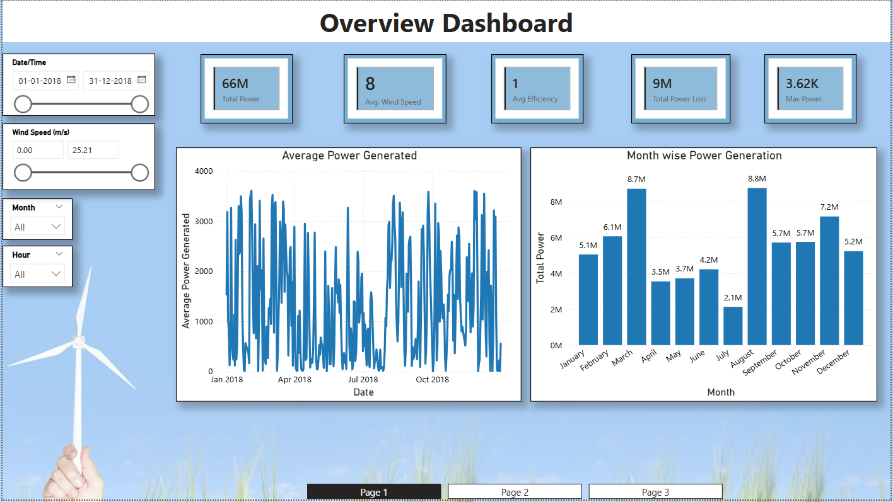
Displays total power generated (66M kW), average wind speed (8 m/s), average efficiency, total power loss (9M kW), and maximum power (3.62K kW). Includes a daily average power trend line and month-wise power generation bar chart with interactive slicers for date range, wind speed, month, and hour.

### Page 2: Wind Analysis
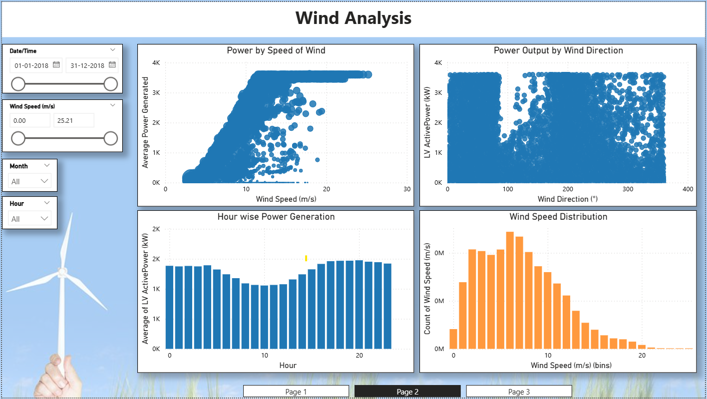
Explores the wind-power relationship through four visuals: power output by wind speed (scatter), power output by wind direction (scatter), hour-wise average power generation (bar), and wind speed frequency distribution (histogram).

### Page 3: Performance Analysis
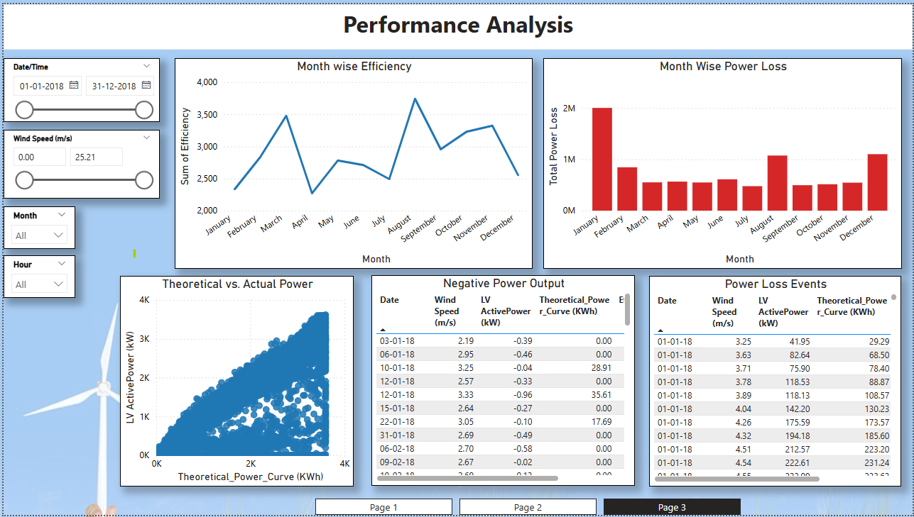
Covers turbine efficiency and loss analysis including month-wise efficiency trend, month-wise power loss bar chart, theoretical vs. actual power scatter plot, a table of negative power output events (turbine standby/self-consumption), and a power loss events reference table.

---

## Repository Structure
```
Wind-Turbine-Analysis/
│
├── Dashboard_Images/
│   ├── Power_Bi_Figure_1.png     → Overview Dashboard screenshot
│   ├── Power_Bi_Figure_2.png     → Wind Analysis screenshot
│   └── Power_Bi_Figure_3.png     → Performance Analysis screenshot
│
├── Data/
│   ├── Dataset.csv               → original Kaggle raw dataset
│   └── Processed_Data.csv        → cleaned and enriched dataset
│
├── Notebooks/
│   ├── data/
│   │   └── Processed_Data.csv    → processed data copy used by script
│   ├── images/                   → all Python EDA chart outputs
│   │   ├── P1.png   (Power Loss Distribution)
│   │   ├── P2.png   (Wind Speed vs Power Loss)
│   │   ├── P3.png   (Wind Speed Distribution)
│   │   ├── P4.png   (Active Power Distribution)
│   │   ├── P5.png   (Wind Speed vs Active Power)
│   │   ├── P6.png   (Wind Speed vs Theoretical Power)
│   │   ├── P7.png   (Actual vs Theoretical Power)
│   │   ├── P8.png   (Monthly Power Generation)
│   │   ├── P9.png   (Hourly Average Power)
│   │   ├── P10.png  (Wind Direction vs Active Power)
│   │   └── P11.png  (Correlation Matrix)
│   ├── Wind_Analysis.py          → full Python EDA script
│   └── Requirement.txt           → Python dependencies
│
├── Power_Bi/
│   └── Wind_Analysis.pbix        → interactive Power BI dashboard (3 pages)
│
└── README.md
```

## How to Reproduce

**Python Script:**
1. Download the raw dataset from the Kaggle link above
2. Place it at `data/raw/Dataset.csv`
3. Install dependencies: `pip install -r requirements.txt`
4. Run the script: `python data_cleaning_analysis.py`
5. Processed data will be saved to `data/Processed_Data.csv` and all charts saved to `images/`

**Power BI Dashboard:**
1. Open `powerbi/wind_dashboard.pbix` in Power BI Desktop (free download from Microsoft)
2. If prompted, update the data source path to point to your local `data/Processed_Data.csv`
3. Refresh the data and explore the interactive dashboard

---

## Requirements
```
pandas
numpy
matplotlib
seaborn
```
Install all dependencies with:
```
pip install -r requirements.txt

```
---

## Author
**Kanageswari**
Data Analyst | Power BI | Python | SQL
[LinkedIn Profile](https://www.linkedin.com/in/kanageswari-m/)
